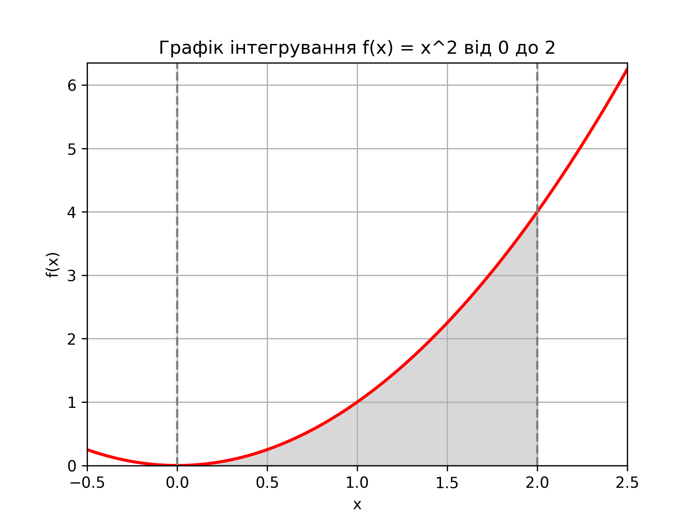
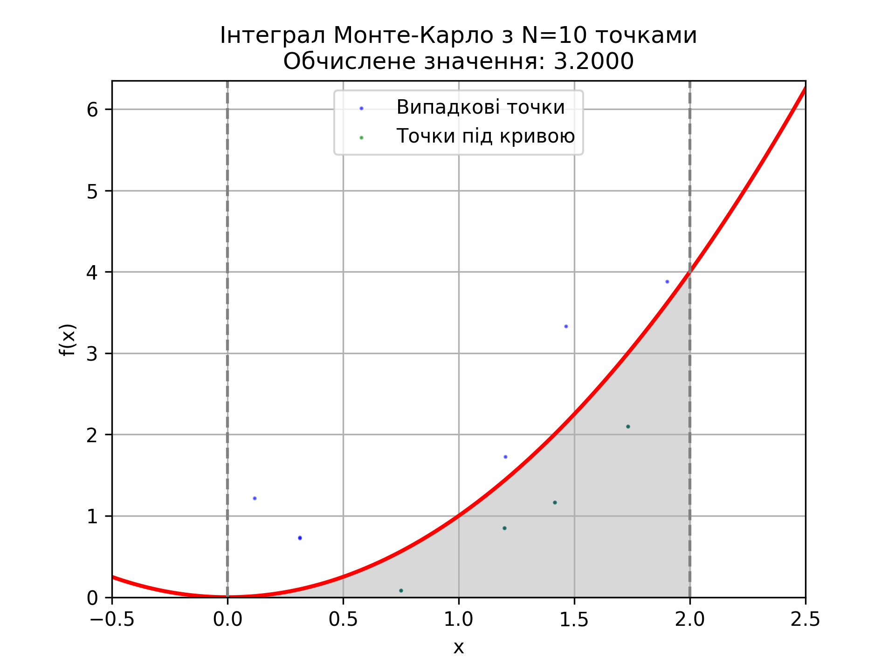
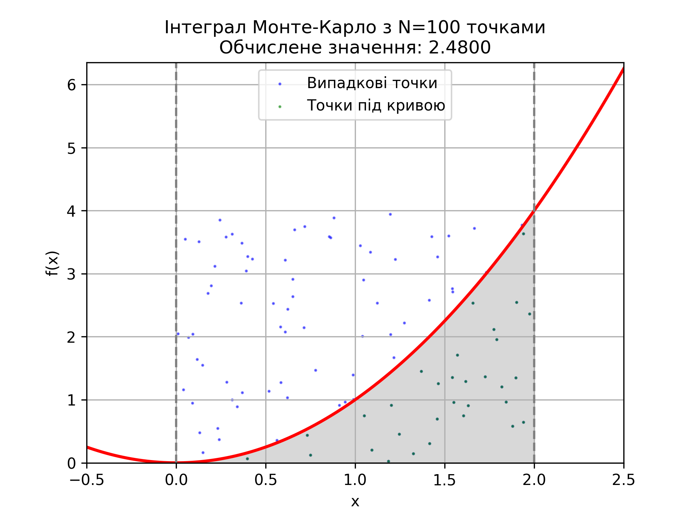
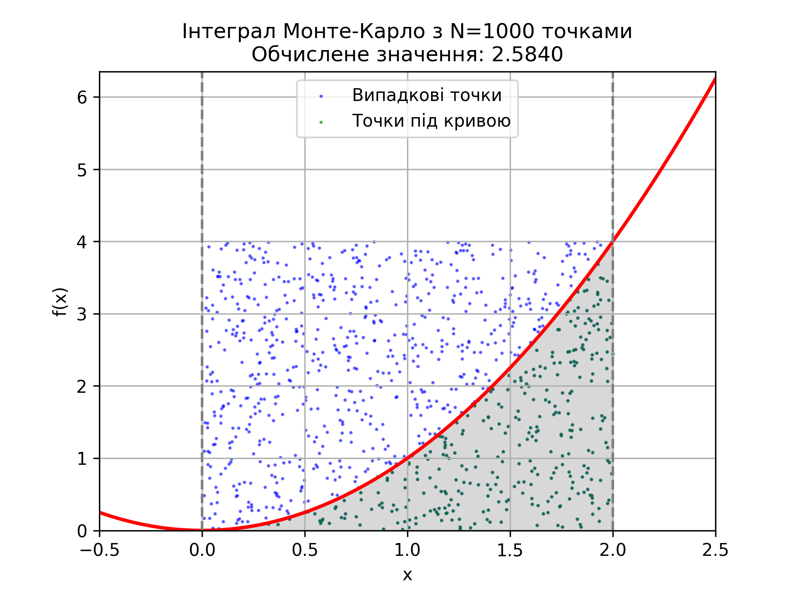
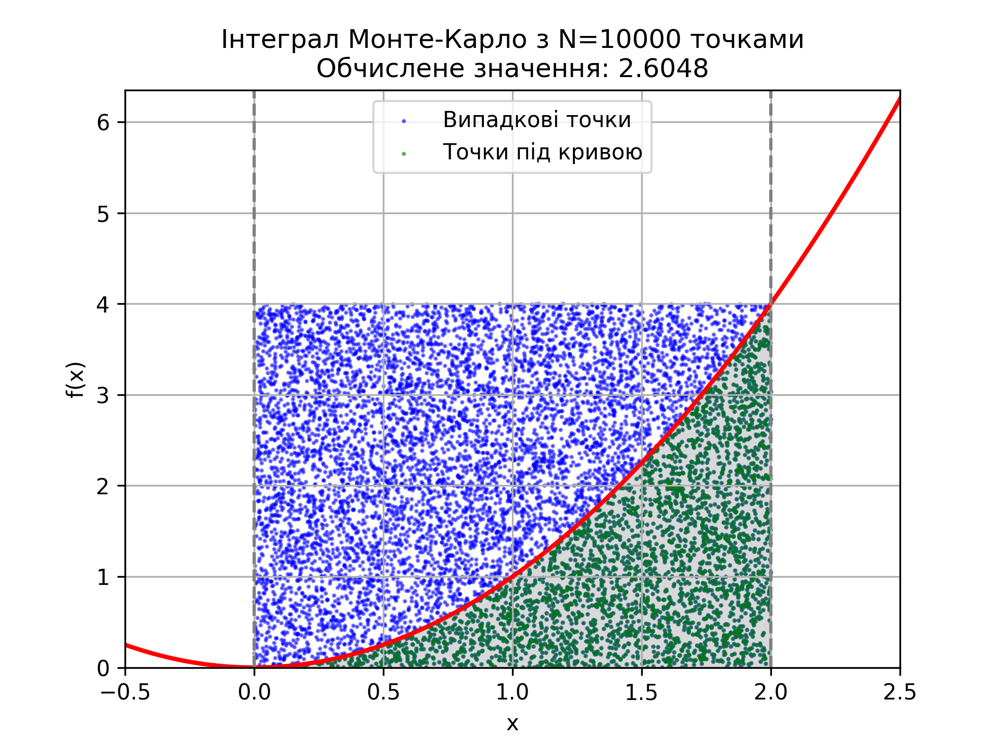
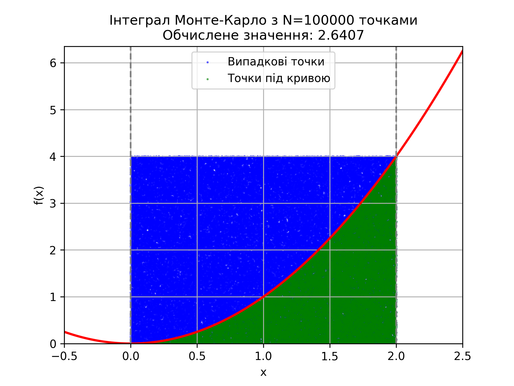
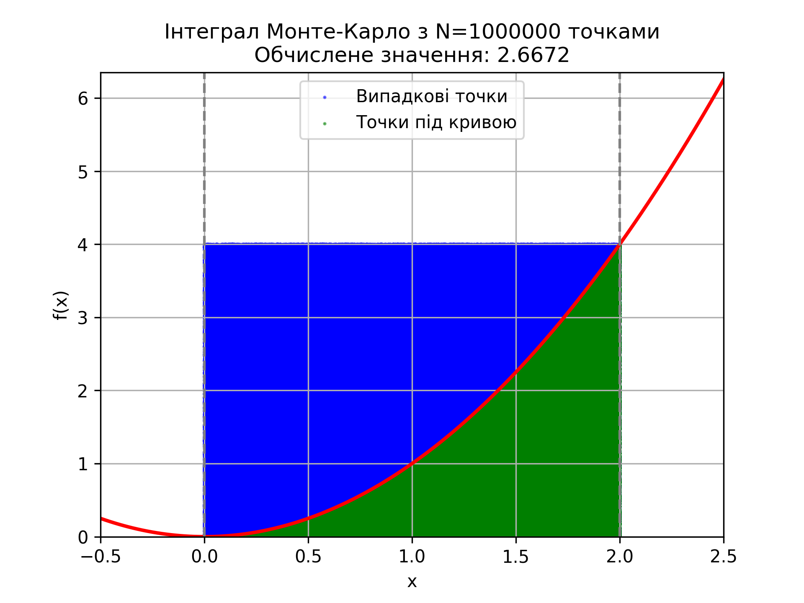

# Дослідження обчислення інтегралу методом Монте-Карло та порівняння з аналітичними розрахунками

## Вступ

Метою цієї роботи є оцінка значення визначеного інтегралу функції \( f(x) = x^2 \) на відрізку \([0, 2]\) методом Монте-Карло. Даний метод використовує випадкові точки для наближеного обчислення площі під графіком функції. Для підтвердження точності результатів метод Монте-Карло порівнюється з аналітичним результатом, розрахованим за допомогою функції `quad` з бібліотеки SciPy.

## Опис методу Монте-Карло

Метод Монте-Карло полягає у генеруванні випадкових точок у прямокутнику, що охоплює область під графіком функції, та підрахунку частки точок, які потрапили під криву. Площа під графіком (тобто значення інтегралу) обчислюється як:
\[
\text{Інтеграл} \approx \frac{\text{Кількість точок під кривою}}{\text{Загальна кількість точок}} \times \text{площа прямокутника}
\]
Для різних значень кількості точок \( N \) можна оцінити, як точність результатів змінюється зі зростанням \( N \).

## Аналітичне значення інтегралу

Аналітичне значення інтегралу обчислено за допомогою функції `quad`, що є чисельним методом високої точності:

- **Аналітичний інтеграл**: 2.6667
- **Оцінка похибки методом SciPy**: \(2.9606 \times 10^{-14}\)

Це значення є базою для порівняння з результатами, отриманими методом Монте-Карло.

## Результати обчислення інтегралу методом Монте-Карло

Аналітичний інтеграл: 2.6667  
Оцінка похибки методом SciPy: 2.9606e-14

| N       | Інтеграл методом Монте-Карло | Абсолютна похибка | Час виконання (мс) |
| ------- | ---------------------------- | ----------------- | ------------------ |
| 10      | 3.2000                       | 0.5333            | 0.26               |
| 100     | 2.4800                       | 0.1867            | 0.25               |
| 1000    | 2.5840                       | 0.0827            | 0.22               |
| 10000   | 2.6048                       | 0.0619            | 0.33               |
| 100000  | 2.6407                       | 0.0259            | 1.32               |
| 1000000 | 2.6672                       | 0.0006            | 13.70              |

Із зростанням кількості точок \( N \) метод Монте-Карло показує зближення до аналітичного значення, а абсолютна похибка зменшується. За \( N = 10 \) похибка становить 0.5333, що свідчить про велику неточність при використанні малої кількості точок. Зі збільшенням \( N \) до 1000000 похибка зменшується до 0.0006, що є прийнятною наближеністю до аналітичного результату.

## Порівняння часу на виконання обчислень

Розрахунки демонструють, що час виконання методу Монте-Карло поступово збільшується із зростанням \( N \). Наприклад, для \( N = 10 \) обчислення триває 0.26 мс, тоді як для \( N = 1000000 \) — 13.70 мс. Це показує, що метод Монте-Карло потребує більше часу для обчислення з великою кількістю точок, проте навіть для \( N = 1000000 \) він залишається досить швидким для практичного використання. У порівнянні з аналітичним методом, який виконується миттєво і з високою точністю, метод Монте-Карло забезпечує гнучкість та наближену точність, однак потребує більше обчислювальних ресурсів із зростанням \( N \).

## Візуалізація

1. **Графік функції \( f(x) = x^2 \)**
   

2. **Графіки з результатами методу Монте-Карло** для різних значень \( N \) від 10 до 1000000, з відображенням випадкових точок. Точки під кривою позначено зеленим, а ті, що над кривою, — синім. Ці рисунки показують, як щільність точок під кривою зростає з підвищенням \( N \), що покращує наближення до точного значення інтегралу.
   
   
   
   
   
   

## Висновки

Метод Монте-Карло показав свою ефективність для наближеного обчислення інтегралів, однак точність значною мірою залежить від кількості випадкових точок \( N \). Зі збільшенням \( N \) абсолютна похибка значно зменшується, наближаючись до аналітичного значення. Проте зростання \( N \) також призводить до збільшення часу виконання обчислень, що вказує на необхідність знаходити компроміс між точністю та обчислювальними ресурсами. Метод Монте-Карло може бути особливо корисним для наближених обчислень у випадках, де аналітичний розв'язок є складним або недоступним.
